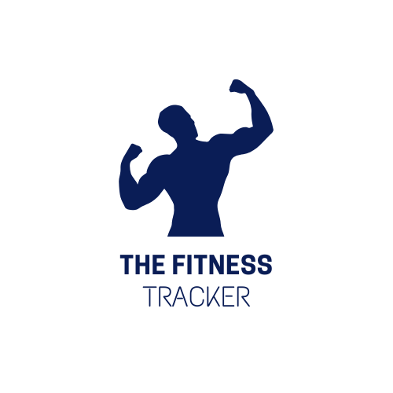

<a name="readme-top"></a>

<!-- PROJECT SHIELDS -->
[![Contributors][contributors-shield]][contributors-url]
[![Forks][forks-shield]][forks-url]
[![Stargazers][stars-shield]][stars-url]
[![Issues][issues-shield]][issues-url]
[![MIT License][license-shield]][license-url]

<!-- PROJECT LOGO -->
<br />
<div align="center">
  <a href="https://github.com/your_username_/Project-Name">
    
  </a>

  <h3 align="center">Fitness Tracker Client</h3>

  <p align="center">
    A sleek and responsive front-end for a fitness tracking application.
    <br />
    <a href="https://github.com/your_username_/Project-Name"><strong>Explore the docs »</strong></a>
    <br />
    <br />
    <a href="https://github.com/your_username_/Project-Name">View Demo</a>
    ·
    <a href="https://github.com/your_username_/Project-Name/issues">Report Bug</a>
    ·
    <a href="https://github.com/your_username_/Project-Name/issues">Request Feature</a>
  </p>
</div>

<!-- TABLE OF CONTENTS -->
<details>
  <summary>Table of Contents</summary>
  <ol>
    <li><a href="#about-the-project">About The Project</a></li>
    <li>
      <a href="#getting-started">Getting Started</a>
      <ul>
        <li><a href="#prerequisites">Prerequisites</a></li>
        <li><a href="#installation">Installation</a></li>
      </ul>
    </li>
    <li><a href="#usage">Usage</a></li>
    <li><a href="#roadmap">Roadmap</a></li>
    <li><a href="#contributing">Contributing</a></li>
    <li><a href="#license">License</a></li>
    <li><a href="#contact">Contact</a></li>
    <li><a href="#acknowledgments">Acknowledgments</a></li>
  </ol>
</details>


<!-- ABOUT THE PROJECT -->
## About The Project


The Fitness Tracker Client is a React-based front-end application designed to provide users with an intuitive interface for tracking their fitness activities. This project leverages the power of React and Ant Design to create an engaging and user-friendly experience.


### Built With

* [React.js](https://reactjs.org/)
* [Ant Design](https://ant.design/)


<!-- GETTING STARTED -->
## Getting Started

To get a local copy up and running follow these simple steps.

### Prerequisites

* npm
  ```sh
  npm install npm@latest -g
  ```

### Installation

1. Clone the repo
   ```sh
   git clone https://github.com/your_username_/Project-Name.git
   ```
2. Install NPM packages
   ```sh
   npm install
   ```


<!-- USAGE EXAMPLES -->
## Usage

Use this project to track fitness activities, monitor progress, and maintain a healthy lifestyle.

_For more examples, please refer to the [Documentation](https://example.com)_


<!-- ROADMAP -->
## Roadmap

- [ ] Add more fitness tracking features
- [ ] Integrate with backend API
- [ ] Add user authentication and profile management
- [ ] Expand the test suite
- [ ] Multi-language Support
    - [ ] Mandarin
    - [ ] Japanese
    - [ ] Korean
    - [ ] Russian
    - [ ] German
    - [ ] Spanish
    - [ ] Arabic

See the [open issues](https://github.com/issues) for a full list of proposed features (and known issues).


<!-- CONTRIBUTING -->
## Contributing

Contributions are what make the open source community such an amazing place to learn, inspire, and create. Any contributions you make are **greatly appreciated**.

If you have a suggestion that would make this better, please fork the repo and create a pull request. You can also simply open an issue with the tag "enhancement".
Don't forget to give the project a star! Thanks again!

1. Fork the Project
2. Create your Feature Branch (`git checkout -b feature/AmazingFeature`)
3. Commit your Changes (`git commit -m 'Add some AmazingFeature'`)
4. Push to the Branch (`git push origin feature/AmazingFeature`)
5. Open a Pull Request


<!-- LICENSE -->
## License

Distributed under the MIT License. See `LICENSE.txt` for more information.


<!-- CONTACT -->
## Contact

Sheneeza Volcov - [@your_twitter](https://twitter.com/your_username) - thepolyglot8@gmail.com

Project Link: [https://github.com/your_username/repo_name](https://github.com/your_username/repo_name)


<!-- ACKNOWLEDGMENTS -->
## Acknowledgments

* [React Icons](https://react-icons.github.io/react-icons/search)
* [Ant Design](https://ant.design/)


<p align="right">(<a href="#readme-top">back to top</a>)</p>